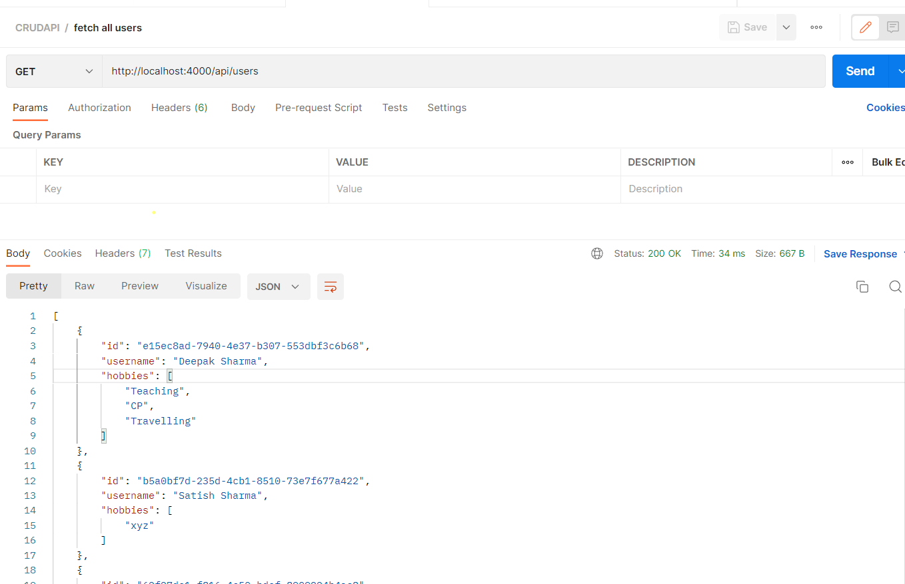
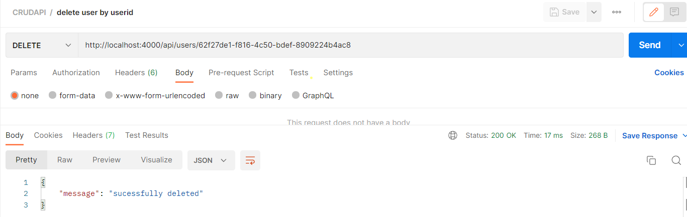

# CRUD-API
CRUDAPI is a backend project built using the **Express.js** framework in **Node.js**. It provides a set of **APIs** for performing **CRUD** (Create, Read, Update, Delete) operations on user data.


## Features
- **_Create_**: Allows you to create a new user by providing the necessary details.

- ***Read***: Provides the ability to fetch user details for all users or a specific user using their unique user ID.

- ***Update***: Allows you to update the details of any user by specifying their user ID.

- ***Delete***: Provides the functionality to delete user details by specifying their user ID.


## Technologies Used

- ***Nodejs***: A runtime environment for executing JavaScript code on the server-side.

- ***Express.js***: A minimal and flexible web application framework for Node.js.

- ***MongoDB***: A NoSQL database for storing user data.


## Getting Started
1. Clone the repository: 
```bash
 git clone https://github.com/DeepakSharma72/CRUD-API.git
```
2. Navigate to the project directory: `cd CRUDAPI`

3. Install dependencies: 
```bash
    npm install
```

4. Start the Server
    -  Production Mode:
    ```bash
       npm run start:prod
    ```
    - Development Mode:
    ```
        npm run start:dev
    ```


## API Documentation

### 1. Create User


### 2. Fetch User Details

- Get All Users


- Get a Specific User by Userid


### 3. Update User


### 4. Delete User



